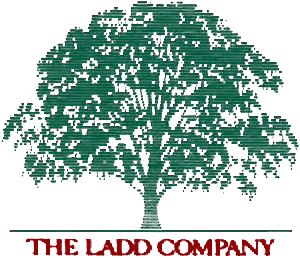

##&#10132; Cinema

+ [MUBI Ratings & Reviews](https://mubi.com/es/users/272774 "Online movie streaming service")

Favorite movies:

    + Les Quatro Cents Coupes.  François Truffaut (1959).

    + Blade Runner. Ridley Scott (1982).

  

--- 

##&#10132; Music

+ [My Playlist at Spotify](https://open.spotify.com/user/leobardo_oscar "1,504 Public Playlists")

--- 

##&#10132; Dogs
--- 

##&#10132; Photography

--- 

## &#10132; Lexicography
###English Spanish Dictionary

+ Description:

This is not intended to be a professional dictionary by any means.
This is just a collection of English vocabulary used in news, debates and opinion shows. 
The goal is to learn the intricacies of building an online dictionary.
I'm just an enthuisiast of lexicography.
Work in progress :-)

+ Link:
[[&#10075;  Lexonomy English - Spanish Dictionary &#10076;](https://www.lexonomy.eu/#english_spanish "Home page")] 

+ Tools I recommend: 

    + [Skell - Sketch Engine for language learning](https://skell.sketchengine.eu "Corpus")

    + [Word Hippo](https://www.wordhippo.com/ "Synonyms, ")

--- 

##&#10132; Nephologist 

+ Cloud observation & appreciation

