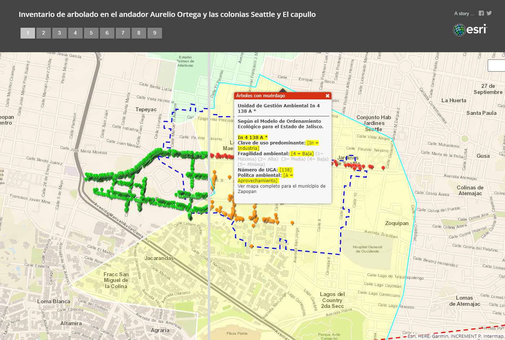
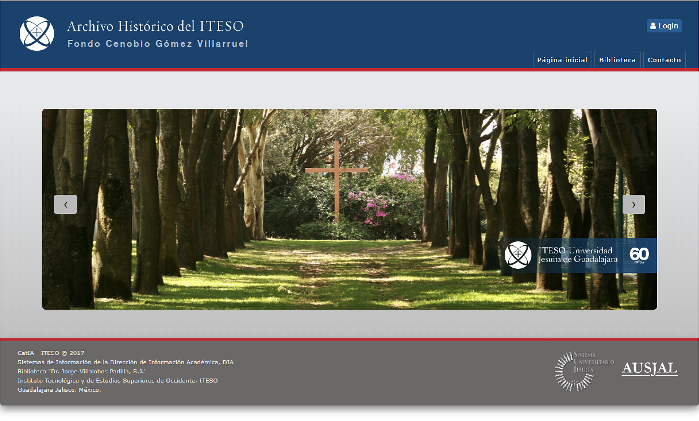

# Project Gallery
## Geomatics
+ Mistletoe-infested trees. Inventory within an urban polygon.
ESRI ArcGIS & ArcGIS StoryMaps.

{ align=left } 

[Available online [here] ](https://www.arcgis.com/apps/StorytellingSwipe/index.html?appid=e02b45f5efb74b10a24bc7ad9f962b7f " ESRI ArcGis Story Maps").

[More images on Behance Portfolio [here]](https://leobardooscar.myportfolio.com/ " ").

[Boostrap version CV & Project Gallery [here] ](https://leobardooscar.github.io/portfolio/geomatics.html "Geomatics").

---

## GUI & UX design

+ University Historic Photograph Collection
Open Access Initiative, OAI.

{ align=left } 

[More proyects on Behance Portfolio [here]](https://leobardooscar.myportfolio.com/university-historic-photograph-collection "Behance portfolio ").

[Boostrap version CV & Project Gallery [here] ](https://leobardooscar.github.io/portfolio/gui_ux.html "GUI & UX design works").

---

## SVG GUI design

 
